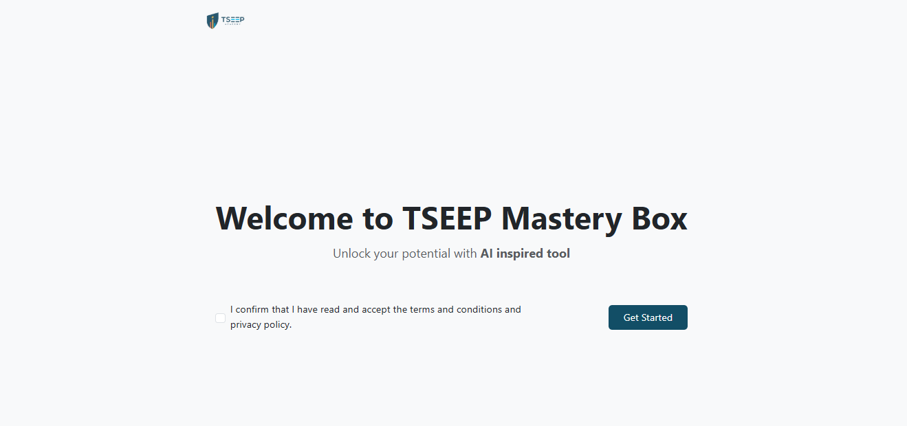
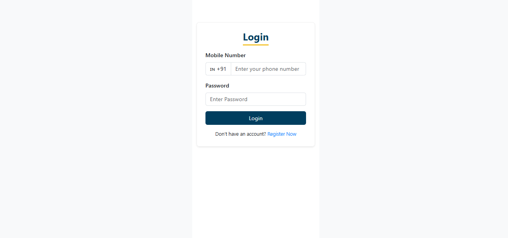
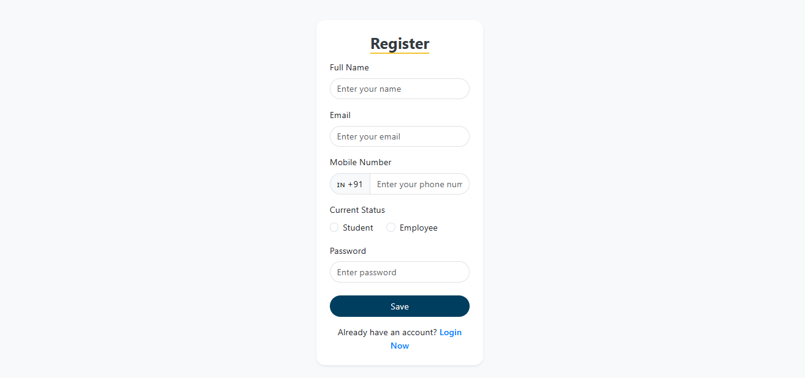
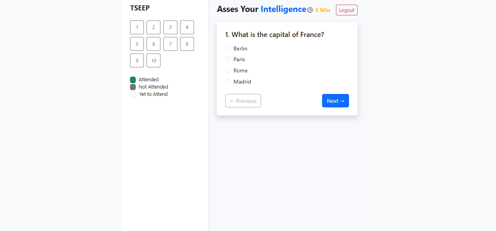
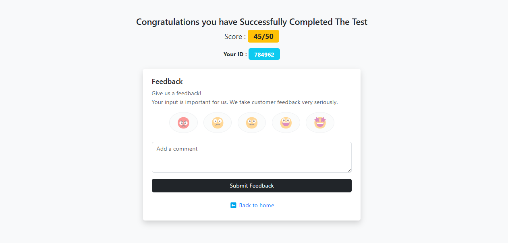

# 🏆 Tseep Academy

**An online test platform built with the MERN stack, where users can register, log in, take a 10-question MCQ test, view their scores, and provide feedback using emojis and messages.**  

---

## 🚀 Features

✅ **User Authentication** – Register and login functionality  
✅ **MCQ Test** – 10 multiple-choice questions  
✅ **Score Calculation** – Instant test results  
✅ **Feedback System** – Users can give feedback using emojis and messages  

---

## 🛠 Tech Stack

| Technology  | Usage  |
|-------------|--------|
| **Frontend** | React, Bootstrap CSS |
| **Backend**  | Node.js, Express.js |
| **Database** | MongoDB |
| **Authentication** | (JWT) |

---

## ⚡ Installation & Setup

### 1️⃣ Clone the Repository  
```bash
git clone https://github.com/your-username/tseep-academy.git
cd tseep-academy
```

### 2️⃣ Install Dependencies  

#### Backend  
```bash
cd backend
npm install
```

#### Frontend  
```bash
cd frontend
npm install
```

### 3️⃣ Set Up Environment Variables  

Create a `.env` file inside the **backend** folder and add:  
```env
MONGO_URI=your_mongodb_connection_string
JWT_SECRET=your_jwt_secret
PORT=your_port
```

### 4️⃣ Run the Project  

#### Backend  
```bash
cd backend
npm start
```

#### Frontend  
```bash
cd frontend
npm start
```

---

## 📸 Screenshots








